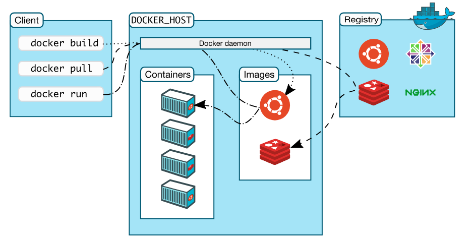

docker docker docker docker

docker docker docker

docker docker

## Введение в Docker

docker docker

docker docker docker

---

### Основные аспекты

- Знакомство: Что такое docker?
- Причины такой популярности: гибкость, легкость установки...
- Основные термины: образ,контейнер...
- Технология докер
- Основные команды: docker ps, docker images ...
- Сборка образа

---

@title[Знакомство]

## @color[black](Знакомство)

@fa[arrow-down text-black]

//необходимо сказать, что идея контейнеров - не нова

@snap[west split-screen-heading text-orange span-50]
Docker Engine

@snapend

@snap[west split-screen-heading text-orange span-50]
Docker architecture

@snapend

@snap[east text-white span-45]
@ol[split-screen-list](false)
- Lorem ipsum dolor sit amet, consectetur elit
- Ut enim ad minim veniam, quis exercitation
- Duis aute irure dolor in reprehenderit in voluptate
@olend
@snapend

@snap[south-west template-note text-gray]
Split-screen heading and list body template.
@snapend

---

### Причины популярности

- Гибкость: Даже самые сложные приложения могут быть заключены в контейнер
- Простота и компактность: Контейнеры используют ядро хоста
- Легкость внесения обновлений: Можно устанавливать обновления быстро и легко
- Легко переносимый: возможность установки локально, в облаке
- Масштабируемость: можно автоматически разворачивать контейнеры где-угодно 
- Удобно сложенные - легкость внесения дополнительных изменений

---
### Docker Compose

---

### Полезные ссылки
- Установка Docker Community Edition:
https://docs.docker.com/install/linux/docker-ce/ubuntu/#install-docker-ce
